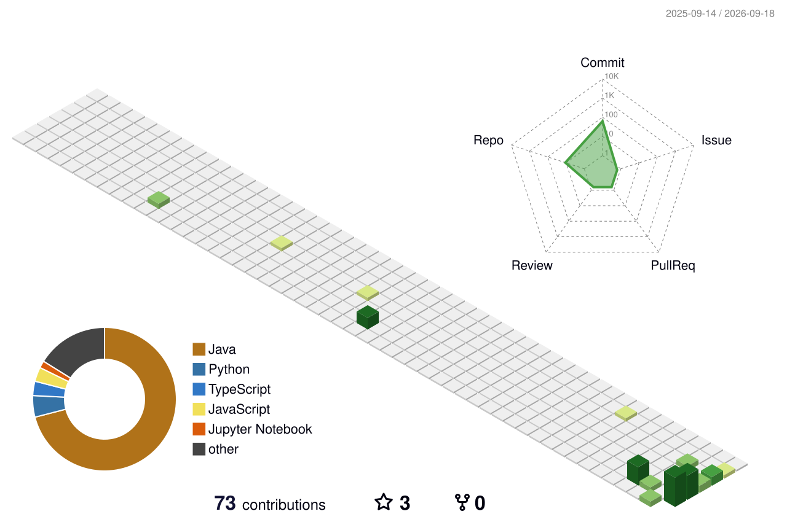

# 👋 Hey, I'm Gunavarman!

<div align="center">


<br>


</div>

---

## 🧠 About Me

```python
class Gunavarman:

    def __init__(self):
        self.name = "Gunavarman P"
        self.role = "AI Engineer & Full Stack Developer"
        self.education = "B.Tech AI & Data Science"
        self.focus = [
            "Artificial Intelligence",
            "Machine Learning",
            "Deep Learning",
            "Generative AI",
            "Agentic AI",
            "RAG Systems",
            "Full Stack Development",
            "MLOps & Cloud"
        ]

    def currently_building(self):
        return [
            "AI-powered applications",
            "RAG-based intelligent systems",
            "Agentic AI workflows",
            "ML & DL solutions",
            "Full Stack AI products"
        ]

    def mindset(self):
        return "Learn → Build → Deploy → Improve 🚀"
```

---

## 🚀 My Tech Universe

<div align="center">

### 🤖 Artificial Intelligence


<br><br>

### 🧠 Generative AI


**LangChain • LangGraph • LangSmith • RAG • LLMs • AI Agents • Prompt Engineering**

<br><br>

### 💻 Full Stack Development


<br><br>

### 🗄️ Databases


<br><br>

### ☁️ Cloud & DevOps


</div>

---

## 🔥 What I'm Working On

<table>
<tr>
<td width="50%">

### 🤖 AI Engineering

* Machine Learning
* Deep Learning
* Generative AI
* Agentic AI
* RAG Applications
* LLM Applications

</td>

<td width="50%">

### 🌐 Full Stack

* React / Next.js
* Node.js / Express
* FastAPI
* MongoDB / MySQL
* REST APIs
* Cloud Deployment

</td>
</tr>
</table>

---

## 🛠️ Featured Projects

### 🧠 AI NOVA

> Intelligent AI chatbot powered by modern AI technologies.

### 📚 Advanced RAG System

> Retrieval-Augmented Generation system using LLMs, embeddings and vector search.

### 📈 MLOps Recommendation System

> End-to-end ML system with experiment tracking, model serving and API deployment.

### 💰 Expense Tracker

> Full-stack expense management application built with React and Node.js.

### ❤️ Emotion Detection System

> Deep Learning based emotion classification system.

---


## 📊 GitHub Analytics

<div align="center">


</div>

---

## 🔥 GitHub Streak

<div align="center">


</div>

---

## ⚡ Developer Philosophy

<div align="center">

### `Code → Learn → Experiment → Build → Deploy → Repeat`

<br>

**"Don't just learn AI. Build with AI." 🤖**

</div>

---

## 🌐 Connect With Me

<div align="center">

<a href="https://github.com/varma2905">

</a>

<a href="https://my-portfolio-05-smoky.vercel.app/">

</a>

</div>

---
## 🧊 3D Contribution Graph

<div align="center">



</div>

<div align="center">


### 🚀 Building the Future with AI

**Thanks for visiting my profile! ⭐**

</div>

## 🐍 My Contributions

<div align="center">

<picture>
  <source media="(prefers-color-scheme: dark)"
          srcset="https://raw.githubusercontent.com/varma2905/varma2905/output/github-snake-dark.svg">

  <source media="(prefers-color-scheme: light)"
          srcset="https://raw.githubusercontent.com/varma2905/varma2905/output/github-snake.svg">

  
</picture>

</div>
